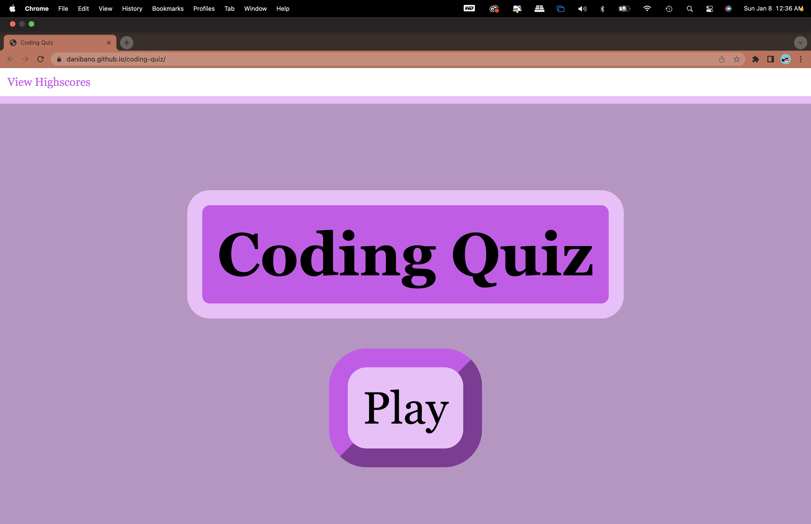
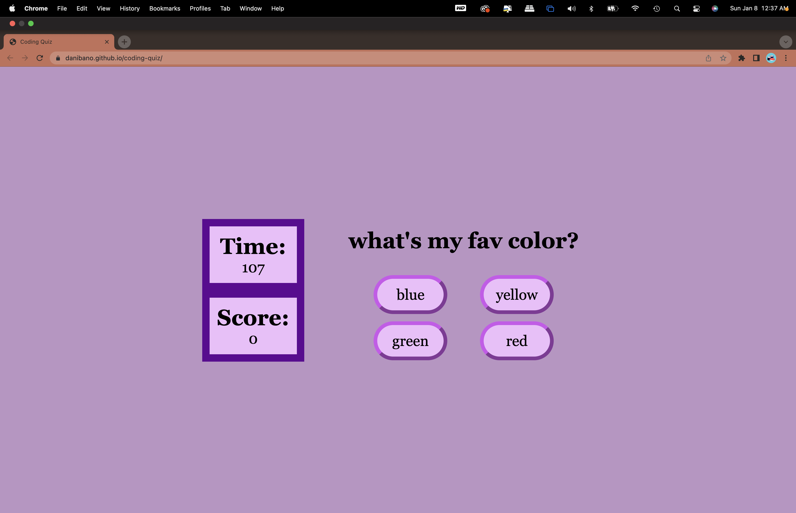
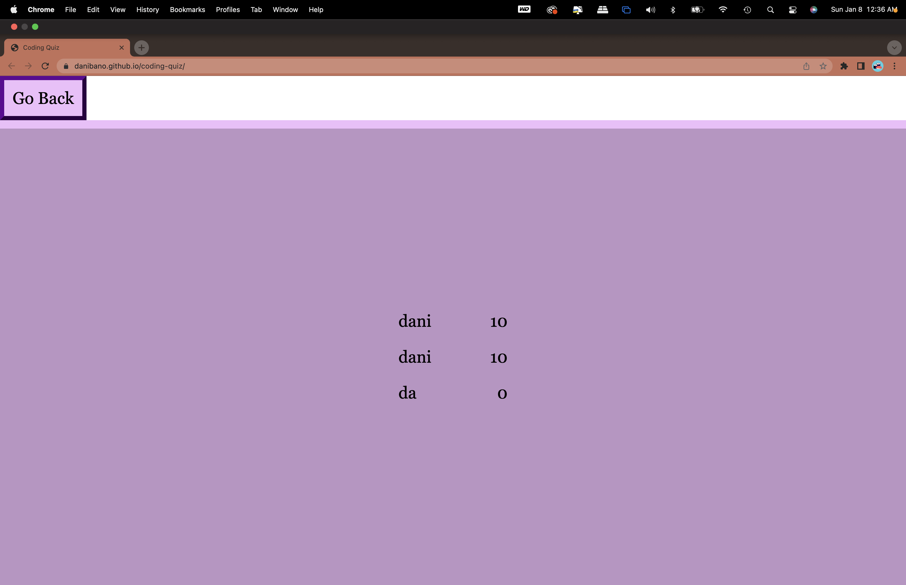

# Coding Quiz

## Description

This is a quiz made with JavaScript. When you start the quiz a timer starts counting down,
but if answer a question incorrectly you'll lose time! The quiz is over when either all questions are answered or the timer reaches 0. You then get to submit your score to the leaderboard. In this module I learned how to save data to a local storage, having a timer function and using an event listener.

## Table of Contents

- [Installation](#installation)
- [Usage](#usage)
- [License](#license)

## Installation

Click [here.](https://danibano.github.io/coding-quiz/)

## Usage

## License
